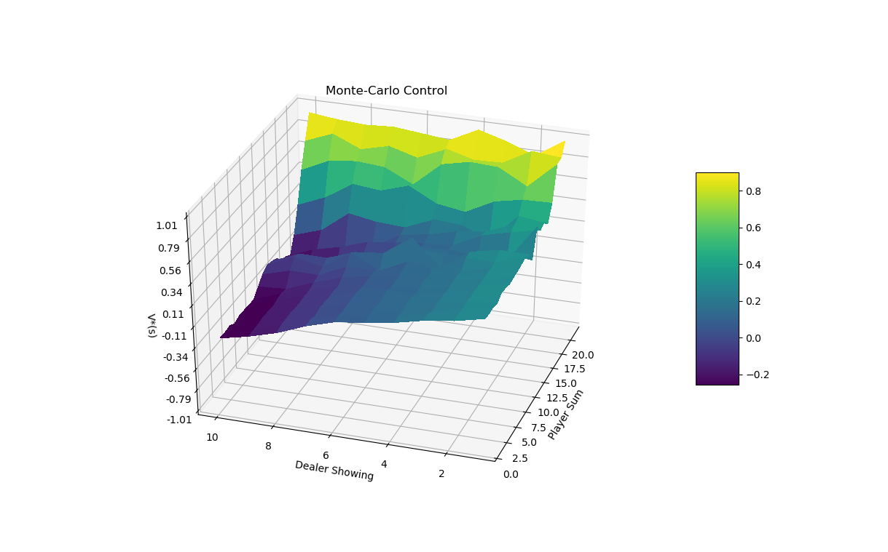
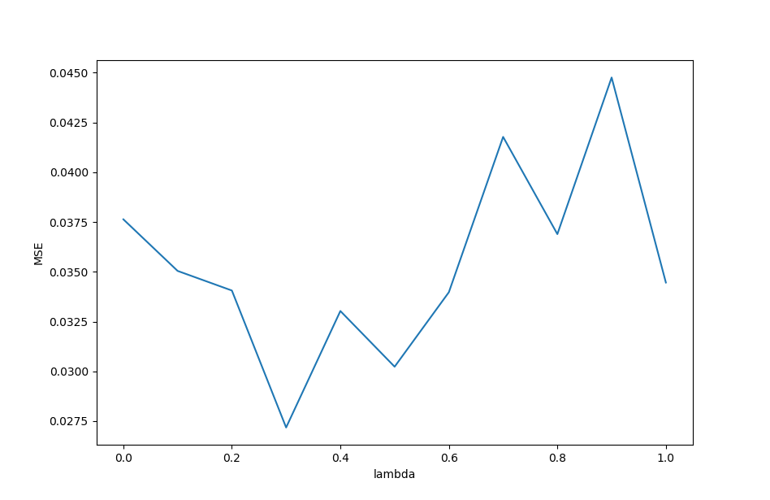
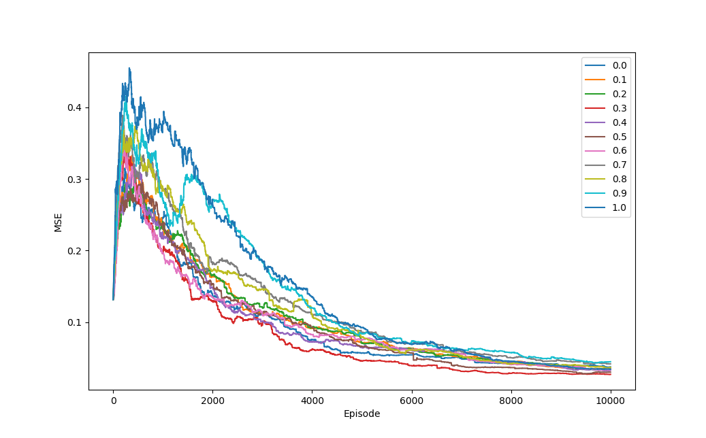
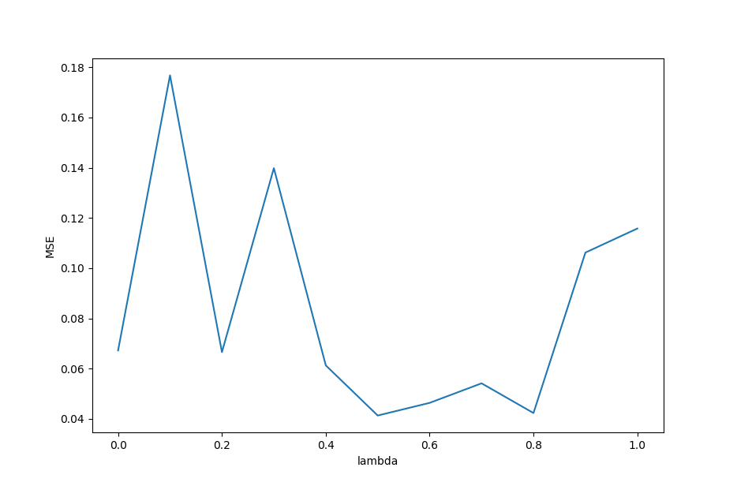

# Easy21 Assignment of David Silver's Reinforcement Learning Course

## Content
This project contains the solution to the Easy21 game defined in the assignment of David Silvers's Reinforcement course. 

## Implementation of Easy21
The game is implemented in the file environment.py. This contains a methods called step which accepts a state and an action as input. The return value is the new state after the action was executed. 

## Monte-Carlo Control in Easy21
The implementation of the Monto-Carlo control can be found in the file Main_Easy21_MC.py. Below the optimal value function is plotted after 1 million Monte-Carlo episodes were executed. The value corresponds to the expected reward if the action with the largest value is picked.

## TD Learning in Easy21
The implementation of Sarsa can be found in the file Main_Easy21_Sarsa.py. Below the mean squared error after 10000 iterations compared to the value function obtained by the previous task is plotted for different lambdas.

Below the evolution of the mean squared error compared to the value function from the previous task is plotted. 

## Linear Function Approximation in Easy21
The implementation of Sarsa with function approximation can be found in the file Main_Easy21_FuncApprox.py. Below the mean squared error after 10000 iterations compared to the value function obtained by Monte-Carlo control is plotted for different lambdas.

Below the evolution of the mean squared error compared to the value function obtained by Monte-Carlo control is plotted. 

